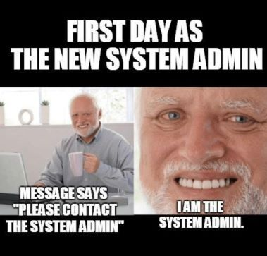

# Deep In System - Linux Server Administration Project



## Table of Contents

- [Project Overview](#project-overview)
- [Objectives](#objectives)
- [Project Structure](#project-structure)
- [Getting Started](#getting-started)
- [System Setup](#system-setup)
- [Network Configuration](#network-configuration)
- [Security](#security)
- [User Management](#user-management)
- [Services](#services)
- [Backup](#backup)
- [Docker & DevOps](#docker--devops)
- [Deployment](#deployment)
- [Documentation](#documentation)
- [Troubleshooting](#troubleshooting)

---

## Project Overview

This project provides comprehensive Linux server administration training. It covers setting up an Ubuntu server from scratch, including network configuration, security hardening, service installation (FTP, MySQL, WordPress), and DevOps tools (Jenkins, SonarQube, Docker).

### What You'll Learn

- Linux system administration
- Network configuration (static IP, firewall)
- Security implementation (SSH hardening, user management)
- Service deployment (FTP, MySQL, WordPress)
- Backup automation with cron
- Docker containerization
- CI/CD pipeline basics

---

## Objectives

1. Implement learned skills from scripting in a real-life project
2. Have a first experience in Ubuntu server setup
3. Discover network and security implementations in Linux
4. Discover popular services in Linux

---

## Project Structure

```
deep-in-system/
├── system/                    # System configuration files
│   ├── disk-partitioning.md   # Partition setup guide
│   ├── essential-packages.md # Required packages
│   ├── hostname.md            # Hostname configuration
│   └── updates.md            # System updates guide
├── networking/                # Network configuration
│   ├── static-ip.md          # Static IP setup
│   └── netplan-config.yaml  # Netplan configuration template
├── security/                 # Security configurations
│   ├── firewall.md           # Firewall guide
│   ├── ufw-rules.md         # UFW rules reference
│   └── ssh-config           # SSH configuration template
├── users/                    # User management
│   ├── create-users.md       # User creation guide
│   └── sudo-config.md        # Sudo configuration
├── services/                 # Service installations
│   ├── mysql/               # MySQL setup
│   │   └── mysql-setup.md
│   ├── wordpress/           # WordPress installation
│   │   ├── wordpress-install.md
│   │   └── nginx-config     # Nginx configuration
│   ├── ftp/                 # FTP server
│   │   ├── ftp-setup.md
│   │   └── vsftpd.conf      # VSFTPD configuration
│   └── backup/              # Backup system
│       ├── backup-db.sh     # Backup script
│       ├── backup-structure.md
│       └── cron-config.md   # Cron setup
├── scripts/                 # Installation scripts
│   ├── install-docker.sh
│   ├── install-jenkins.sh
│   ├── install-sonarqube.sh
│   └── backup-db.sh
├── devops/                  # DevOps tools
│   ├── jenkins/
│   │   ├── Jenkinsfile      # Jenkins pipeline
│   │   ├── setup.md
│   │   └── plugins.md
│   ├── sonarqube/
│   │   ├── setup.md
│   │   └── sonar-config.md
│   └── pipelines/
│       ├── deployment.md
│       └── pipeline-flow.md
├── docker/                  # Docker configurations
│   ├── docker-compose.yml
│   └── install-docker.md
├── deployment/              # Deployment guides
│   ├── docker-compose-buy01.yml
│   ├── buy01-deploy.md
│   └── rollback.md
├── docs/                    # Documentation
│   ├── architecture.md
│   ├── ci-cd.md
│   ├── networking.md
│   ├── roadmap.md
│   ├── security.md
│   ├── services.md
│   └── troubleshooting.md
└── README.md               # This file
```

---

## Getting Started

### Prerequisites

- Ubuntu Server LTS (latest)
- Virtual Machine with 30GB disk
- At least 4GB RAM (recommended)

### Initial Setup

1. **Install Ubuntu Server**
   - Follow the [Disk Partitioning Guide](system/disk-partitioning.md)

2. **Configure Hostname**
   - Use format: `{username}-host`
   - See [Hostname Configuration](system/hostname.md)

3. **Install Essential Packages**
   - See [Essential Packages](system/essential-packages.md)

---

## System Setup

### Disk Partitioning

The VM disk must be 30GB divided into:

| Partition | Size | Mount Point | File System |
|-----------|------|-------------|-------------|
| swap      | 4G   | [SWAP]      | swap        |
| /         | 15G  | /           | ext4        |
| /home     | 5G   | /home       | ext4        |
| /backup   | 6G   | /backup     | ext4        |

**Guide**: [Disk Partitioning](system/disk-partitioning.md)

### System Updates

Keep your system updated:

```bash
sudo apt update
sudo apt upgrade -y
```

**Guide**: [System Updates](system/updates.md)

---

## Network Configuration

### Static IP

Configure a static private IP address:

**Guide**: [Static IP Configuration](networking/static-ip.md)
**Template**: [Netplan Configuration](networking/netplan-config.yaml)

### Verify Internet Connection

```bash
ping -c 5 google.com
```

---

## Security

### SSH Configuration

- **Port**: Changed from 22 to 2222
- **Root Login**: Disabled
- **Authentication**: SSH keys for luffy, password for zoro

**Configuration**: [SSH Config Template](security/ssh-config)

### Firewall (UFW)

Configure UFW to block all incoming ports except necessary ones:

**Guide**: [Firewall Configuration](security/firewall.md)
**Reference**: [UFW Rules](security/ufw-rules.md)

---

## User Management

### Create Users

| User | Authentication | Sudo | Home |
|------|---------------|------|------|
| luffy | SSH Key | Yes | /home/luffy |
| zoro | Password | No | /home/zoro |
| nami | FTP | No | /backup |

**Guide**: [User Creation](users/create-users.md)

### Sudo Configuration

**Guide**: [Sudo Configuration](users/sudo-config.md)

---

## Services

### FTP Server

Install and configure vsftpd:

- User `nami` can only access `/backup`
- Read-only access
- Anonymous login disabled

**Guide**: [FTP Setup](services/ftp/ftp-setup.md)
**Config**: [vsftpd.conf](services/ftp/vsftpd.conf)

### MySQL Database

- Install MySQL Server
- Disable remote root access
- Create dedicated WordPress user

**Guide**: [MySQL Setup](services/mysql/mysql-setup.md)

### WordPress

- Install WordPress at `http://{host}/`
- Protect wp-config.php
- Configure Nginx

**Guide**: [WordPress Installation](services/wordpress/wordpress-install.md)
**Config**: [Nginx Configuration](services/wordpress/nginx-config)

---

## Backup

### Automated Backup

- Cron job runs daily at 00:00
- Backs up WordPress database
- Stores in `/backup` directory
- Logged to `/var/log/backup.log`

**Script**: [Backup Script](services/backup/backup-db.sh)
**Guide**: [Backup Structure](services/backup/backup-structure.md)
**Cron**: [Cron Configuration](services/backup/cron-config.md)

### Access Backups via FTP

Use `nami` user to download backups from FTP server.

---

## Docker & DevOps

### Docker

**Guide**: [Docker Installation](docker/install-docker.md)
**Compose**: [docker-compose.yml](docker/docker-compose.yml)

### Jenkins

**Guide**: [Jenkins Setup](devops/jenkins/setup.md)
**Plugins**: [Jenkins Plugins](devops/jenkins/plugins.md)
**Pipeline**: [Jenkinsfile](devops/jenkins/Jenkinsfile)

### SonarQube

**Guide**: [SonarQube Setup](devops/sonarqube/setup.md)
**Config**: [SonarQube Configuration](devops/sonarqube/sonar-config.md)

### CI/CD Pipeline

**Flow**: [Pipeline Flow](devops/pipelines/pipeline-flow.md)
**Deployment**: [Deployment Guide](devops/pipelines/deployment.md)

---

## Deployment

### Buy-01 Microservices

**Compose**: [docker-compose-buy01.yml](deployment/docker-compose-buy01.yml)
**Guide**: [Buy-01 Deployment](deployment/buy01-deploy.md)

### Rollback Procedures

**Guide**: [Rollback Guide](deployment/rollback.md)

---

## Documentation

- [Architecture](docs/architecture.md)
- [CI/CD Guide](docs/ci-cd.md)
- [Networking Guide](docs/networking.md)
- [Security Guide](docs/security.md)
- [Services Guide](docs/services.md)
- [Troubleshooting](docs/troubleshooting.md)

---

## Troubleshooting

Common issues and solutions:

### Network Issues
- [Network Troubleshooting](docs/networking.md)

### SSH Issues
- [Security Troubleshooting](security/ssh-config)

### Service Issues
- [Troubleshooting Guide](docs/troubleshooting.md)

---

## Installation Scripts

Automated installation scripts available in `/scripts/`:

```bash
# Install Docker
sudo bash scripts/install-docker.sh

# Install Jenkins
sudo bash scripts/install-jenkins.sh

# Install SonarQube
sudo bash scripts/install-sonarqube.sh
```

---

## Important Notes

> **Security Warning**: This project includes exposed passwords and private keys for learning purposes. Do NOT use these in production!

> **Advice**:
> - Read the entire project before starting implementation
> - Understand all commands before executing them
> - Save all commands for future reference
> - Create backups of configuration files before modifying

---

## Project Files Reference

### Required Files for Submission

- `deep-in-system.sha1` - SHA1 hash of exported VM
- `README.md` - This file

### Key Configuration Files

| File | Purpose |
|------|---------|
| [networking/netplan-config.yaml](networking/netplan-config.yaml) | Network configuration template |
| [security/ssh-config](security/ssh-config) | SSH daemon configuration |
| [services/ftp/vsftpd.conf](services/ftp/vsftpd.conf) | FTP server configuration |
| [services/wordpress/nginx-config](services/wordpress/nginx-config) | WordPress Nginx config |
| [docker/docker-compose.yml](docker/docker-compose.yml) | Docker services |
| [deployment/docker-compose-buy01.yml](deployment/docker-compose-buy01.yml) | Buy-01 deployment |

---

## Quick Command Reference

```bash
# System
sudo apt update && sudo apt upgrade -y

# Network
sudo netplan apply

# Firewall
sudo ufw status
sudo ufw allow 2222/tcp

# Services
sudo systemctl start nginx
sudo systemctl status mysql
sudo systemctl restart vsftpd

# Docker
docker-compose up -d
docker ps

# Backup
sudo /usr/local/bin/backup-db.sh
```

---

## License

This project is for educational purposes.

---

*For audit questions and requirements, see [AUDIT.md](AUDIT.md)*
*For project subject and instructions, see [SUBJECT.md](SUBJECT.md)*
