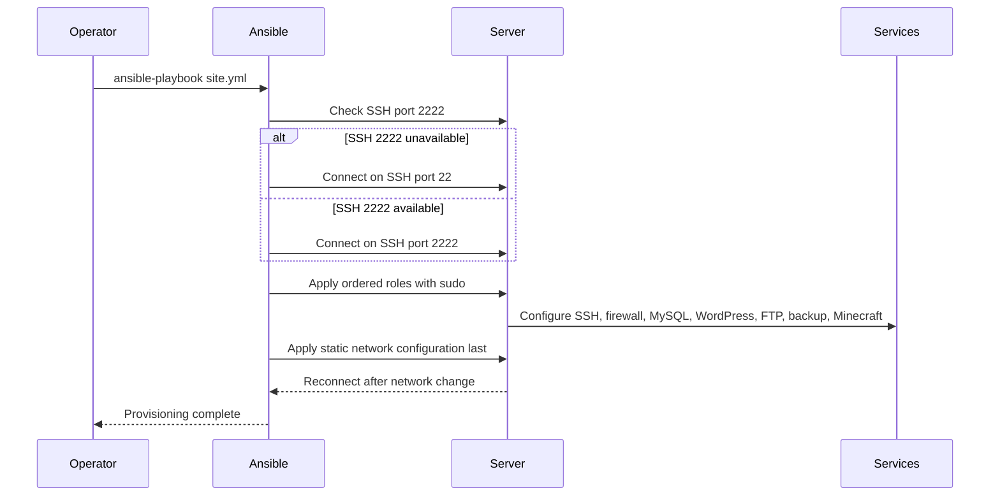
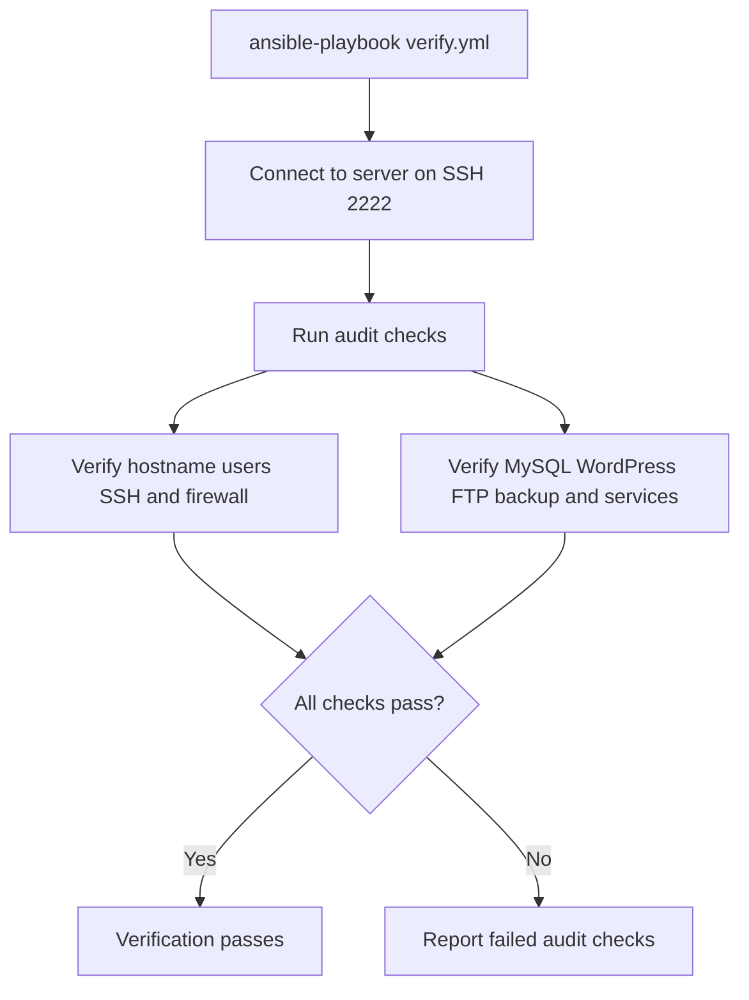

<!-- Generated by sourcery-ai[bot]: start review_guide -->

## Reviewer's Guide

This PR automates the server build with Ansible: it introduces ordered, tagged roles for system, network, security, users, FTP, MySQL, TLS, WordPress, backups, and Minecraft; adds vault-based configuration and an audit verification playbook; and updates the README to describe the complete setup and validation workflow.

#### Sequence diagram for idempotent server provisioning

#### Flow diagram for audit verification

### File-Level Changes

| Change | Details | Files |
| ------ | ------- | ----- |
| Replaced the primarily manual project documentation with an end-to-end Ansible setup and verification workflow. | <ul><li>Added inventory, configuration, dependency, vault, tagging, and idempotent playbook instructions.</li><li>Added a verification playbook covering host, network, SSH, firewall, users, MySQL, WordPress, backups, and service health.</li><li>Documented VM creation, local prerequisites, vault setup, execution, auditing, and VM export procedures.</li></ul> | `README.md` `ansible/.gitignore` `ansible/ansible.cfg` `ansible/inventory.yml` `ansible/requirements.yml` `ansible/group_vars/all/vars.yml` `ansible/group_vars/all/vault.yml.example` `ansible/site.yml` `ansible/verify.yml` `docs/REQUIREMENTS.md` |
| Implemented Ansible roles to provision and configure the complete server stack. | <ul><li>Configured hostname, packages, sudo membership, shell aliases, static networking, and cloud-init behavior.</li><li>Configured SSH hardening and port migration, UFW rules, luffy/zoro accounts, FTP access for nami, and local-only MySQL with a dedicated WordPress user.</li><li>Provisioned self-signed TLS, Apache/PHP/WordPress, protected wp-config.php, scheduled database backups, and a systemd-managed Minecraft server.</li></ul> | `ansible/roles/common/tasks/main.yml` `ansible/roles/network/tasks/main.yml` `ansible/roles/network/templates/static-ip.yaml.j2` `ansible/roles/ssh/tasks/main.yml` `ansible/roles/ssh/templates/ssh.conf.j2` `ansible/roles/firewall/tasks/main.yml` `ansible/roles/users/tasks/main.yml` `ansible/roles/ftp/tasks/main.yml` `ansible/roles/ftp/templates/vsftpd.conf.j2` `ansible/roles/mysql/tasks/main.yml` `ansible/roles/ssl/tasks/main.yml` `ansible/roles/wordpress/tasks/main.yml` `ansible/roles/wordpress/templates/wordpress.conf.j2` `ansible/roles/backup/tasks/main.yml` `ansible/roles/backup/templates/backup.sh.j2` `ansible/roles/minecraft/tasks/main.yml` `ansible/roles/minecraft/templates/minecraft.service.j2` `ansible/roles/ftp/handlers/main.yml` `ansible/roles/mysql/handlers/main.yml` `ansible/roles/ssh/handlers/main.yml` `ansible/roles/wordpress/handlers/main.yml` `ansible/roles/minecraft/handlers/main.yml` |
| Removed the previous manual backup implementation and step-by-step setup document in favor of role-managed automation. | <ul><li>Deleted the standalone backup script.</li><li>Deleted the former manual setup guide.</li></ul> | `scripts/backup-db.sh` `docs/STEPS.md` |

---

Tips and commands

#### Interacting with Sourcery

- **Trigger a new review:** Comment `@sourcery-ai review` on the pull request.
- **Continue discussions:** Reply directly to Sourcery's review comments.
- **Generate a GitHub issue from a review comment:** Ask Sourcery to create an
  issue from a review comment by replying to it. You can also reply to a
  review comment with `@sourcery-ai issue` to create an issue from it.
- **Generate a pull request title:** Write `@sourcery-ai` anywhere in the pull
  request title to generate a title at any time. You can also comment
  `@sourcery-ai title` on the pull request to (re-)generate the title at any time.
- **Generate a pull request summary:** Write `@sourcery-ai summary` anywhere in
  the pull request body to generate a PR summary at any time exactly where you
  want it. You can also comment `@sourcery-ai summary` on the pull request to
  (re-)generate the summary at any time.
- **Generate reviewer's guide:** Comment `@sourcery-ai guide` on the pull
  request to (re-)generate the reviewer's guide at any time.
- **Resolve all Sourcery comments:** Comment `@sourcery-ai resolve` on the
  pull request to resolve all Sourcery comments. Useful if you've already
  addressed all the comments and don't want to see them anymore.
- **Dismiss all Sourcery reviews:** Comment `@sourcery-ai dismiss` on the pull
  request to dismiss all existing Sourcery reviews. Especially useful if you
  want to start fresh with a new review - don't forget to comment
  `@sourcery-ai review` to trigger a new review!

#### Customizing Your Experience

Access your [dashboard](https://app.sourcery.ai) to:
- Enable or disable review features such as the Sourcery-generated pull request
  summary, the reviewer's guide, and others.
- Change the review language.
- Add, remove or edit custom review instructions.
- Adjust other review settings.

#### Getting Help

- [Contact our support team](mailto:support@sourcery.ai) for questions or feedback.
- Visit our [documentation](https://docs.sourcery.ai) for detailed guides and information.
- Keep in touch with the Sourcery team by following us on [X/Twitter](https://x.com/SourceryAI), [LinkedIn](https://www.linkedin.com/company/sourcery-ai/) or [GitHub](https://github.com/sourcery-ai).

<!-- Generated by sourcery-ai[bot]: end review_guide -->